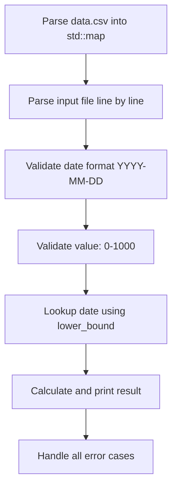
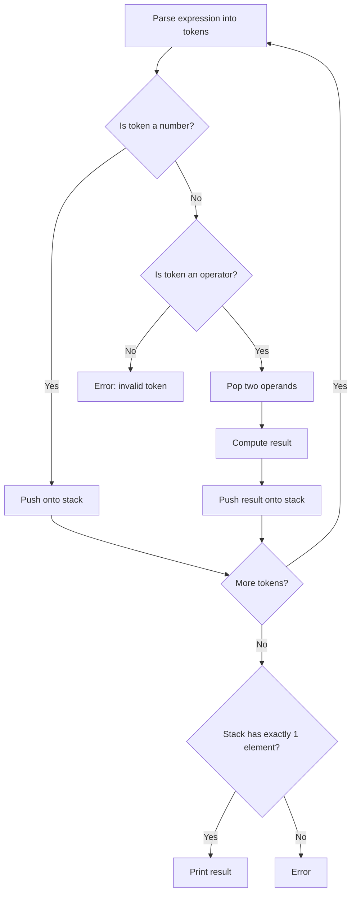
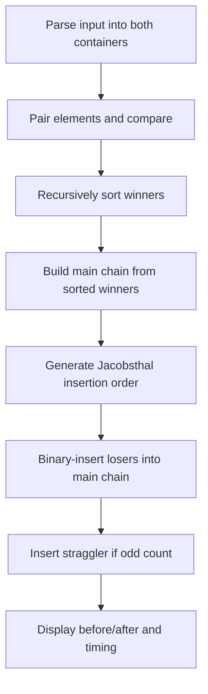

# CPP Module 09 — Full Analysis & Roadmap

## General Rules

| Rule | Detail |
|------|--------|
| **Standard** | C++98 |
| **Orthodox Canonical Form** | Every class needs: default constructor, copy constructor, copy-assignment operator, destructor |
| **Compilation** | `c++ -Wall -Wextra -Werror -std=c++98` |
| **Forbidden** | `printf()`, `alloc()`, `free()`, `using namespace`, `friend` keyword |
| **Allowed** | STL containers **and** STL algorithms are fully authorized in this module |

> [!IMPORTANT]
> This is the first module where the STL is **fully unlocked**. You can (and should) use `std::map`, `std::stack`, `std::vector`, `std::deque`, `std::list`, `std::algorithm`, etc. The challenge is choosing the **right container** for each exercise.

---

## Exercise 00 — Bitcoin Exchange

### What You Must Build
A program called `btc` that reads an **input file** (passed as argument) containing lines of `date | value`, and outputs the result of `value × exchange_rate` for each line, using a **CSV database** of historical Bitcoin prices.

### Turn-in Files
| File | Purpose |
|------|---------|
| `Makefile` | Builds the `btc` binary |
| `main.cpp` | Entry point, file argument handling |
| `BitcoinExchange.cpp` | Core logic |
| `BitcoinExchange.hpp` | Class declaration |

### Input Format
```
date | value
```
- **Date**: `YYYY-MM-DD` format (must be a valid date)
- **Value**: A float or positive integer, must be between **0 and 1000**

### Database Format (`data.csv`)
```
date,exchange_rate
2009-01-02,0
2011-01-03,0.3
...
```
The database spans from 2009 to 2022 with ~1614 entries.

### The Key Logic: Date Lookup
If the exact date is **not found** in the database, you must use the **closest earlier date**. This is the critical requirement.

**Example:**
```
Input:  2011-01-03 | 3
DB has: 2011-01-01 → 0.3 (exact match not found, use closest lower)

Output: 2011-01-03 => 3 = 0.9
```

### Error Handling
You must handle and print errors for:
- Negative values → `Error: not a positive number.`
- Values > 1000 → `Error: too large a number.`
- Invalid date format → `Error: bad input => <line>`
- Empty/missing file

### Expected Output
```
2011-01-03 => 3 = 0.9
2011-01-03 => 2 = 0.6
2011-01-03 => 1 = 0.3
2011-01-09 => 1 = 0.32
Error: not a positive number.
Error: bad input => 2001-42-42
2012-01-11 => 1 = 7.1
Error: too large a number.
```

### Key Concepts to Learn

#### 1. `std::map<std::string, float>`
This is the **ideal container** for this exercise because:
- It stores **key-value pairs** (date → rate)
- Keys are **automatically sorted** (dates in chronological order as strings)
- It provides `lower_bound()` and `upper_bound()` for efficient "closest date" lookups

```cpp
std::map<std::string, float> database;

// Finding closest lower date:
std::map<std::string, float>::iterator it = database.lower_bound(date);
// lower_bound returns iterator to first element NOT LESS than key
// If exact match: it points to the match
// If no exact match: it points to the first element GREATER than key
//   → so you do --it to get the closest LOWER date
```

#### 2. File I/O (`std::ifstream`)
```cpp
std::ifstream file("data.csv");
std::string line;
while (std::getline(file, line)) {
    // parse each line
}
```

#### 3. String Parsing
Use `line.find(',')` or `line.find('|')` to split lines, then `substr()` to extract parts. Convert strings to floats with `strtod()` or `atof()`.

#### 4. Date Validation
You'll need to validate:
- Format is exactly `YYYY-MM-DD`
- Year, month, day are valid numbers
- Month is 1–12, day is 1–31 (bonus: handle month-specific limits and leap years)

---

## Exercise 01 — Reverse Polish Notation (RPN)

### What You Must Build
A program called `RPN` that takes a **single string argument** containing a mathematical expression in Reverse Polish Notation, evaluates it, and prints the result.

### Turn-in Files
| File | Purpose |
|------|---------|
| `Makefile` | Builds the `RPN` binary |
| `main.cpp` | Entry point |
| `RPN.cpp` | RPN evaluation logic |
| `RPN.hpp` | Class declaration |

### What is Reverse Polish Notation?
RPN (postfix notation) places operators **after** their operands instead of between them.

| Infix (normal) | RPN (postfix) |
|-----------------|--------------|
| `3 + 4` | `3 4 +` |
| `(1 + 2) × 3` | `1 2 + 3 *` |
| `8 ÷ (4 - 2)` | `8 4 2 - /` |

### The Algorithm (Stack-Based)
```
For each token in the expression:
  If token is a NUMBER:
    Push it onto the stack
  If token is an OPERATOR (+, -, *, /):
    Pop two numbers from the stack (b first, then a)
    Compute: result = a OPERATOR b
    Push result back onto the stack
Final answer = the single value left on the stack
```

### Step-by-Step Example: `"8 9 * 9 - 9 - 9 - 4 - 1 +"`
```
Token | Stack         | Action
------+---------------+--------------------
  8   | [8]           | push 8
  9   | [8, 9]        | push 9
  *   | [72]          | pop 9,8 → 8*9=72
  9   | [72, 9]       | push 9
  -   | [63]          | pop 9,72 → 72-9=63
  9   | [63, 9]       | push 9
  -   | [54]          | pop 9,63 → 63-9=54
  9   | [54, 9]       | push 9
  -   | [45]          | pop 9,54 → 54-9=45
  4   | [45, 4]       | push 4
  -   | [41]          | pop 4,45 → 45-4=41
  1   | [41, 1]       | push 1
  +   | [42]          | pop 1,41 → 41+1=42

Result: 42
```

### Constraints
- Numbers are always **less than 10** (single digits: 0–9)
- Supported operators: `+`, `-`, `*`, `/`
- No brackets, no decimals
- Tokens are separated by spaces

### Error Handling
- If not enough operands for an operator → `Error`
- If more than one value remains after processing → `Error`
- Division by zero → `Error`
- Invalid character → `Error`

### Key Concepts to Learn

#### 1. `std::stack<int>`
A LIFO (Last-In, First-Out) container adapter. **Perfect** for RPN evaluation.

```cpp
std::stack<int> stack;
stack.push(42);      // add to top
int top = stack.top(); // peek at top
stack.pop();          // remove top (returns void!)
stack.empty();        // check if empty
stack.size();         // number of elements
```

> [!WARNING]
> `stack.pop()` does **NOT return** the removed element. You must call `stack.top()` first, then `pop()`.

#### 2. Token Parsing
Use `std::istringstream` to split the input string by spaces:
```cpp
std::istringstream iss(expression);
std::string token;
while (iss >> token) {
    // process each token
}
```

---

## Exercise 02 — PmergeMe (Ford-Johnson Sort)

### What You Must Build
A program called `PmergeMe` that sorts a sequence of **positive integers** using the **Ford-Johnson algorithm** (Merge-Insert Sort), implemented with **two different containers**.

### Turn-in Files
| File | Purpose |
|------|---------|
| `Makefile` | Builds the `PmergeMe` binary |
| `main.cpp` | Entry point |
| `PmergeMe.cpp` | Sorting logic |
| `PmergeMe.hpp` | Class declaration |

### Expected Output Format
```bash
$> ./PmergeMe 3 5 9 7 4

Before: 3 5 9 7 4
After:  3 4 5 7 9
Time to process a range of 5 elements with std::vector : 0.00031 us
Time to process a range of 5 elements with std::deque  : 0.00014 us
```

### Requirements
- Must handle at least **3000 integers**
- **Two different containers** must be used (e.g., `std::vector` + `std::deque`)
- Must display: before, after, and timing for each container
- Must handle errors (negative numbers, duplicates?, non-numeric input)

> [!CAUTION]
> The container used in ex00 (`std::map`) and ex01 (`std::stack`) **cannot be reused** as one of your two containers. Use `std::vector` and `std::deque` (or `std::list`).

### Understanding Ford-Johnson (Merge-Insert Sort)

This is the **most complex part** of the module. Ford-Johnson minimizes the number of **comparisons** needed to sort a sequence.

#### The Algorithm — Step by Step

**Step 1: Pair and Compare**
- Group elements into pairs: `(a₁,b₁), (a₂,b₂), ...`
- Within each pair, ensure the larger is first → these become the "main chain" winners
- If odd number of elements, the last one is left unpaired (the "straggler")

**Step 2: Recursively Sort**
- Take all the "winners" (larger elements from each pair) and recursively sort them using the same algorithm
- This gives you a sorted "main chain"

**Step 3: Insert Using Jacobsthal Numbers**
- The "losers" (smaller elements from each pair) must be inserted into the main chain
- **Key insight**: Don't insert them in order 1, 2, 3... Instead, use **Jacobsthal numbers** to determine the insertion order
- Jacobsthal sequence: **1, 3, 5, 11, 21, 43, 85, ...** (each is `J(n) = J(n-1) + 2*J(n-2)`)
- Use **binary search** (`std::lower_bound`) for each insertion to minimize comparisons

#### Why Jacobsthal Numbers?
They ensure that when you insert element at position `k`, you never need more comparisons than the theoretical minimum. The order exploits the fact that binary search over a range of size `2ⁿ - 1` takes exactly `n` comparisons.

#### Visual Example
```
Input: [5, 1, 4, 2, 3]

Step 1 — Pair & Compare:
  (5,1) → winner=5, loser=1
  (4,2) → winner=4, loser=2
  straggler: 3

Step 2 — Recursively sort winners: [4, 5]
  Main chain: [4, 5]
  Paired losers: [2, 1] (2 was paired with 4, 1 was paired with 5)

Step 3 — Insert losers using Jacobsthal order:
  First loser (paired with first main-chain element): 
    Insert 2 → binary search in [4,5] → result: [2, 4, 5]
  Next per Jacobsthal (index 1):
    Insert 1 → binary search in [2, 4, 5] → result: [1, 2, 4, 5]
  Insert straggler:
    Insert 3 → binary search in [1, 2, 4, 5] → result: [1, 2, 3, 4, 5]
```

### Key Concepts to Learn

#### 1. `std::vector` vs `std::deque`
| Feature | `std::vector` | `std::deque` |
|---------|---------------|--------------|
| Memory | Contiguous block | Segmented blocks |
| Random access | O(1) | O(1) |
| Insert at front | O(n) — must shift everything | O(1) |
| Insert at back | Amortized O(1) | O(1) |
| Cache performance | Excellent (contiguous) | Good (chunked) |
| Insert in middle | O(n) | O(n) |

#### 2. Performance Timing
```cpp
#include <ctime>
#include <sys/time.h>

struct timeval start, end;
gettimeofday(&start, NULL);
// ... sort ...
gettimeofday(&end, NULL);
double elapsed = (end.tv_sec - start.tv_sec) * 1000000.0 
               + (end.tv_usec - start.tv_usec);
```

#### 3. `std::lower_bound` for Binary Insertion
```cpp
// Insert val into sorted container using binary search
std::vector<int>::iterator pos = std::lower_bound(vec.begin(), vec.end(), val);
vec.insert(pos, val);
```

#### 4. Jacobsthal Number Generation
```cpp
// J(0)=0, J(1)=1, J(n)=J(n-1)+2*J(n-2)
int jacobsthal(int n) {
    if (n == 0) return 0;
    if (n == 1) return 1;
    return jacobsthal(n - 1) + 2 * jacobsthal(n - 2);
}
// Sequence: 0, 1, 1, 3, 5, 11, 21, 43, 85, 171, ...
```

---

## Roadmap

### Phase 1: Exercise 00 — Bitcoin Exchange (Easiest) ⏱ ~1-2 days



**Steps:**
1. **Learn**: `std::map`, `lower_bound()`, `std::ifstream`, `std::getline`
2. **Implement**: CSV parser to load `data.csv` into `std::map<std::string, float>`
3. **Implement**: Input file parser with validation (date format, value range)
4. **Implement**: Date lookup logic using `lower_bound()` / `--iterator`
5. **Test**: All error cases (negative, too large, bad date, missing file)

---

### Phase 2: Exercise 01 — RPN (Medium) ⏱ ~1 day



**Steps:**
1. **Learn**: `std::stack`, `std::istringstream`
2. **Implement**: Token parser (split by spaces)
3. **Implement**: Stack-based evaluation loop
4. **Implement**: Error handling (division by zero, insufficient operands, extra values)
5. **Test**: Various RPN expressions

---

### Phase 3: Exercise 02 — PmergeMe (Hardest) ⏱ ~3-5 days



**Steps:**
1. **Learn**: Ford-Johnson algorithm theory, Jacobsthal numbers, `std::vector` vs `std::deque`
2. **Implement**: Input parsing and validation
3. **Implement**: Ford-Johnson with `std::vector`
4. **Implement**: Ford-Johnson with `std::deque`
5. **Implement**: Timing measurement
6. **Test**: With 3000+ random integers, edge cases (1 element, 2 elements, already sorted)

> [!TIP]
> **Study resources for Ford-Johnson:**
> - Research "merge-insertion sort" on Wikipedia
> - The algorithm is designed to approach the **information-theoretic lower bound** on comparisons: ⌈log₂(n!)⌉
> - Start by implementing it iteratively with `std::vector` first, then adapt for `std::deque`

---

## Difficulty Summary

| Exercise | Difficulty | Core Challenge | Container |
|----------|-----------|----------------|-----------|
| ex00 | ⭐⭐ | File parsing + `map::lower_bound` | `std::map` |
| ex01 | ⭐ | Stack-based evaluation | `std::stack` |
| ex02 | ⭐⭐⭐⭐⭐ | Ford-Johnson algorithm | `std::vector` + `std::deque` |

> [!WARNING]
> **Exercise 02 is by far the hardest.** Plan to spend most of your time on it. Understanding the Ford-Johnson algorithm conceptually before coding is essential — don't jump into implementation blindly.

## Your Current Progress

You already have a skeleton for ex00:
- [Makefile](file:///home/ael-mans/Desktop/CPP-Module/CPP_09/Makefile) — complete ✅
- [BitcoinExchange.hpp](file:///home/ael-mans/Desktop/CPP-Module/CPP_09/BitcoinExchange.hpp) — Orthodox Canonical Form started ✅
- [main.cpp](file:///home/ael-mans/Desktop/CPP-Module/CPP_09/main.cpp) — argument check done ✅
- [data.csv](file:///home/ael-mans/Desktop/CPP-Module/CPP_09/cpp_09/data.csv) — database provided ✅

**Next immediate step**: Add member variables and methods to `BitcoinExchange.hpp` (a `std::map<std::string, float>` to store the database, methods to load CSV, parse input, and lookup dates).
