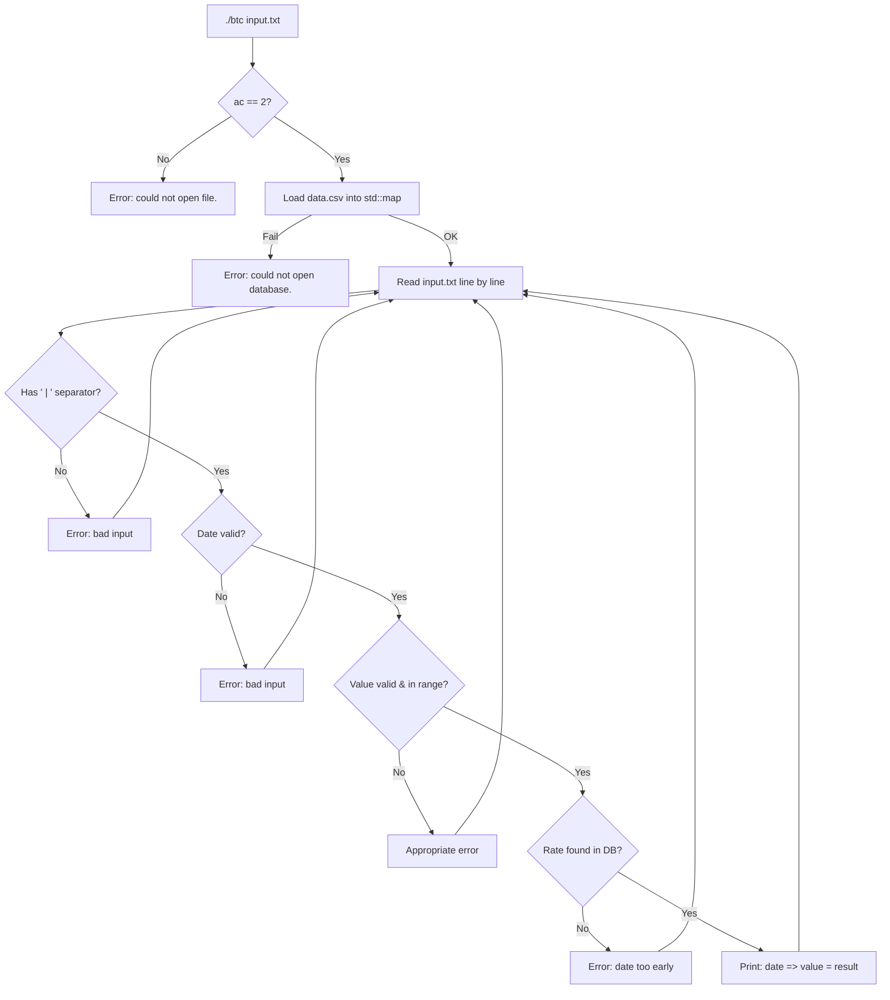

# Ex00 — Bitcoin Exchange: Full Code Explanation

## The Big Picture

The program does one thing: given a user input file with lines like `2012-01-11 | 1`, it looks up the Bitcoin exchange rate on that date (from a CSV database) and prints `date => amount = result`.

```
input:   2011-01-03 | 3
output:  2011-01-03 => 3 = 0.9    (because 3 × 0.3 = 0.9)
```

---

## File-by-File Breakdown

### 1. `BitcoinExchange.hpp` — The Class Blueprint

```cpp
std::map<std::string, float>  _rates;
```

This is the core data structure. A `std::map` stores **key → value** pairs sorted by key. Here:
- **Key** = date string like `"2011-01-03"`
- **Value** = exchange rate like `0.3`

Since `std::map` keeps keys sorted, and dates in `YYYY-MM-DD` format sort chronologically when compared as strings (`"2009"` < `"2011"` < `"2022"`), the map is **automatically sorted by date** without any extra work.

The class has three **private helper methods** (internal tools) and two **public methods** (the interface):

| Method | Role |
|---|---|
| `isDateValid()` | Checks if a date string is real (not `2001-42-42`) |
| `parseValue()` | Converts a string to a float safely |
| `findRate()` | Finds the exchange rate for a given date |
| `loadDatabase()` | Reads `data.csv` into `_rates` |
| `evaluateInput()` | Reads the user's input file and prints results |

The **Orthodox Canonical Form** (required by 42) means we define these 4:
- Default constructor
- Copy constructor
- Copy assignment operator `=`
- Destructor

---

### 2. `BitcoinExchange.cpp` — The Implementation

#### Orthodox Canonical Form (lines 5–19)

```cpp
BitcoinExchange::BitcoinExchange() {}
```
Default constructor — does nothing, creates an empty object.

```cpp
BitcoinExchange::BitcoinExchange(const std::string& dbPath) {
    loadDatabase(dbPath);
}
```
Parametric constructor — creates the object **and** fills `_rates` from the CSV file in one step.

```cpp
BitcoinExchange::BitcoinExchange(const BitcoinExchange& other) : _rates(other._rates) {}
```
Copy constructor — uses the **initializer list** (`: _rates(other._rates)`) to copy the map from `other`. This is more efficient than assigning inside the body because it constructs `_rates` directly with the right data instead of creating an empty map first then overwriting it.

```cpp
BitcoinExchange& BitcoinExchange::operator=(const BitcoinExchange& other) {
    if (this != &other)        // prevent self-assignment (a = a)
        _rates = other._rates;
    return *this;              // return *this to allow chaining (a = b = c)
}
```

---

#### `isDateValid()` — Date Validation (lines 23–55)

This function takes a string and answers: is this a real, valid date?

**Step 1 — Format check:**
```cpp
if (date.length() != 10 || date[4] != '-' || date[7] != '-')
    return false;
```
Must be exactly `YYYY-MM-DD` (10 characters, dashes at positions 4 and 7).

**Step 2 — Digit check:**
```cpp
for (int i = 0; i < 10; i++) {
    if (i == 4 || i == 7) continue;   // skip the dashes
    if (date[i] < '0' || date[i] > '9') return false;
}
```
Every position except the dashes must be a digit.

**Step 3 — Extract year, month, day:**
```cpp
int year  = std::atoi(date.substr(0, 4).c_str());  // "2011" → 2011
int month = std::atoi(date.substr(5, 2).c_str());  // "01"   → 1
int day   = std::atoi(date.substr(8, 2).c_str());  // "03"   → 3
```
`substr(pos, len)` extracts a piece of the string. `atoi()` converts it to an integer.

**Step 4 — Range check with leap year:**
```cpp
int limits[] = {0, 31, 28, 31, 30, 31, 30, 31, 31, 30, 31, 30, 31};
//               ^   J   F   M   A   M   J   J   A   S   O   N   D
//            unused

bool leap = (year % 4 == 0 && year % 100 != 0) || (year % 400 == 0);
if (leap)
    limits[2] = 29;   // Feb gets 29 days in a leap year
```
This catches nonsense like month `42`, day `0`, or Feb 30.

---

#### `parseValue()` — Value Parsing (lines 57–85)

Converts the string after `" | "` into a float. It's strict — no letters, no double dots, no garbage.

```cpp
bool dotSeen = false;
if (raw[0] == '-' || raw[0] == '+')
    start = 1;   // allow a leading sign
```
Then it loops through every character:
- Digits are OK
- One dot is OK (for decimals)
- Two dots, letters, anything else → `false`

Finally:
```cpp
out = std::strtof(raw.c_str(), &end);
```
`strtof` does the actual conversion. The `end` pointer tells us where it stopped reading. If `*end != '\0'`, there was leftover garbage → reject.

---

#### `findRate()` — The Key Algorithm (lines 87–97)

> [!IMPORTANT]
> This is the most important function to understand for your evaluation.

```cpp
std::map<std::string, float>::const_iterator it = _rates.upper_bound(date);
```

`upper_bound(date)` returns an iterator to the **first element whose key is strictly greater than `date`**. For example, if the map has dates `2011-01-01`, `2011-01-04`, `2011-01-07` and you search for `2011-01-03`:

```
                 upper_bound("2011-01-03")
                          ↓
2011-01-01    2011-01-04    2011-01-07
```

Then we go **one step back**:
```cpp
--it;   // now pointing at 2011-01-01
return it->second;
```

This gives us the **closest earlier date** — exactly what the subject asks for.

**Edge case:** if `it == _rates.begin()`, there is no earlier date, so we return `-1` to signal an error.

**Why not `lower_bound`?** `lower_bound` returns the first element **≥** the key. It would work for exact matches, but when the date doesn't exist, `upper_bound` + decrement is cleaner and handles both exact and non-exact cases uniformly.

---

#### `loadDatabase()` — Reading the CSV (lines 101–124)

```cpp
std::ifstream file(dbPath.c_str());
```
Opens the file. `.c_str()` is needed because `ifstream` in C++98 takes a `const char*`, not a `std::string`.

```cpp
std::getline(file, line);   // skip "date,exchange_rate" header
```

Then for each line:
```cpp
std::string::size_type comma = line.find(',');
std::string date    = line.substr(0, comma);      // everything before the comma
std::string rateStr = line.substr(comma + 1);      // everything after
```

Note: the CSV uses `,` as separator (`2011-01-03,0.3`), while the input file uses ` | `.

```cpp
if (*end == '\0' || *end == '\r')
```
The `'\r'` check handles Windows-style line endings (`\r\n`) that might be in the CSV file.

---

#### `evaluateInput()` — The Main Loop (lines 126–179)

This reads the user's input file line by line and processes each one through a **pipeline of validations**:

```
Line → Split on " | " → Validate date → Parse value → Check range → Lookup rate → Print
         ↓ fail           ↓ fail          ↓ fail        ↓ fail        ↓ fail
       "bad input"      "bad input"     "bad input"   "not positive"  "too early"
                                                      "too large"
```

The `continue` keyword skips to the next line whenever an error is found:
```cpp
if (value < 0) {
    std::cerr << "Error: not a positive number." << std::endl;
    continue;   // ← skip the rest, go to next line
}
```

---

### 3. `main.cpp` — Entry Point

```cpp
int main(int ac, char **av) {
    if (ac != 2) {
        std::cerr << "Error: could not open file." << std::endl;
        return 1;
    }

    try {
        BitcoinExchange btc("cpp_09/data.csv");
        btc.evaluateInput(av[1]);
    } catch (std::exception& e) {
        std::cerr << e.what() << std::endl;
        return 1;
    }
    return 0;
}
```

1. Check argument count — needs exactly 1 argument (the input file path)
2. Create a `BitcoinExchange` object, which loads the database in its constructor
3. Call `evaluateInput()` with the path given by the user
4. The `try/catch` handles the case where `data.csv` can't be opened (the constructor throws)

---

## Program Flow Diagram



---

## Expected Output with the Test Input

Given the `input.txt`:
```
date | value
2011-01-03 | 3
2011-01-03 | 2
2011-01-03 | 1
2011-01-03 | 1.2
2011-01-09 | 1
2012-01-11 | -1
2001-42-42
2012-01-11 | 1
2012-01-11 | 2147483648
```

Expected output:
```
2011-01-03 => 3 = 0.9
2011-01-03 => 2 = 0.6
2011-01-03 => 1 = 0.3
2011-01-03 => 1.2 = 0.36
2011-01-09 => 1 = 0.32
Error: not a positive number.
Error: bad input => 2001-42-42
2012-01-11 => 1 = 7.1
Error: too large a number.
```

> [!TIP]
> During evaluation you might be asked to explain `upper_bound` vs `lower_bound`, or how the map stays sorted. These are the key things to know cold.
