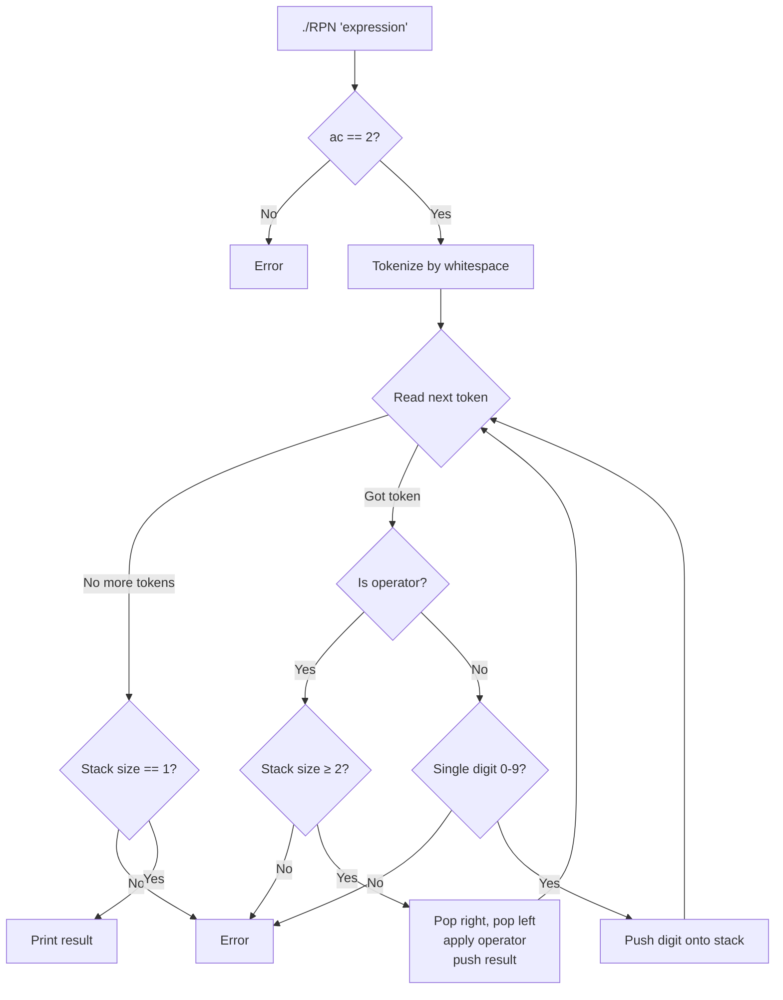

# Ex01 — RPN (Reverse Polish Notation): Full Code Explanation

## The Big Picture

The program takes a mathematical expression in **postfix notation** (operator comes *after* its operands) and evaluates it using a **stack**.

```
Normal (infix):    (8 × 9) - 9 - 9 - 9 - 4 + 1
Postfix (RPN):     8 9 * 9 - 9 - 9 - 4 - 1 +
Result:            42
```

Why postfix? It removes all ambiguity — no brackets needed, no operator precedence rules. You just read left to right and use a stack.

---

## File-by-File Breakdown

### 1. `RPN.hpp` — The Class Blueprint

```cpp
std::stack<long>  _stk;
```

This is the only data member. `std::stack` is a **container adapter** — it wraps another container (by default `std::deque`) and only exposes three operations:
- `push()` — add to the top
- `pop()` — remove from the top
- `top()` — look at the top (without removing)

**Why `long` instead of `int`?** Intermediate results can exceed `int` range. For example, `9 9 * 9 * 9 *` = 6561, and with enough multiplications it could overflow a 32-bit int. `long` gives us more room.

The class has two **private helpers**:

| Method | Role |
|---|---|
| `isOperator()` | Checks if a token is `+`, `-`, `*`, or `/` |
| `applyOp()` | Takes two numbers and an operator, returns the result |

And one **public method**:

| Method | Role |
|---|---|
| `evaluate()` | Processes the entire expression string and returns the final result |

---

### 2. `RPN.cpp` — The Implementation

#### Orthodox Canonical Form (lines 5–15)

```cpp
RPN::RPN() {}
```
Default constructor — creates an RPN object with an empty stack.

```cpp
RPN::RPN(const RPN& other) : _stk(other._stk) {}
```
Copy constructor — copies the entire stack from `other` using the initializer list.

```cpp
RPN& RPN::operator=(const RPN& other) {
    if (this != &other)
        _stk = other._stk;
    return *this;
}
```
Copy assignment — self-assignment check, then copy the stack.

```cpp
RPN::~RPN() {}
```
Destructor — nothing to clean up manually. The `std::stack` destructor handles its own memory.

---

#### `isOperator()` — Token Classification (line 19–21)

```cpp
bool RPN::isOperator(const std::string& token) const {
    return (token == "+" || token == "-" || token == "*" || token == "/");
}
```

Simple check: is this token one of the four allowed operators? Returns `true` or `false`. Nothing else is a valid operator — brackets, `%`, `^` etc. are all errors.

---

#### `applyOp()` — The Math (lines 23–36)

```cpp
long RPN::applyOp(long left, long right, const std::string& op) const {
    if (op == "+") return left + right;
    if (op == "-") return left - right;
    if (op == "*") return left * right;
    if (op == "/") {
        if (right == 0)
            throw std::runtime_error("Error");
        return left / right;
    }
    throw std::runtime_error("Error");
}
```

Takes two operands and an operator, does the math. Two important things:

**1. Parameter naming — `left` and `right`:**
The calling code passes them in the right order (see `evaluate()` below), so `left - right` is correct. This is a common source of bugs.

**2. Division by zero check:**
`right == 0` is caught and throws before we divide. Without this, the program would crash or produce undefined behavior.

The final `throw` at the bottom is a safety net — it should never be reached because `applyOp` is only called after `isOperator()` returns `true`.

---

#### `evaluate()` — The Core Algorithm (lines 40–71)

> [!IMPORTANT]
> This is the most important function to understand for your evaluation.

```cpp
long RPN::evaluate(const std::string& expression) {
    std::istringstream  stream(expression);
    std::string         token;
```

`std::istringstream` wraps the string so we can read from it like a file. The `>>` operator automatically splits by whitespace and skips extra spaces.

---

**The main loop:**
```cpp
    while (stream >> token) {
```
Reads one token at a time: `"8"`, `"9"`, `"*"`, `"9"`, `"-"`, ...

---

**Branch 1 — Token is an operator:**
```cpp
        if (isOperator(token)) {
            if (_stk.size() < 2)
                throw std::runtime_error("Error");

            long right = _stk.top();  // first pop = RIGHT operand
            _stk.pop();
            long left = _stk.top();   // second pop = LEFT operand
            _stk.pop();

            _stk.push(applyOp(left, right, token));
```

> [!WARNING]
> **Pop order matters!** The stack is LIFO (Last In, First Out), so the **most recently pushed** number becomes the **right** operand. If you swap left and right, subtraction and division give wrong results.

Example: expression `3 1 -`
- Push 3, push 1 → stack: `[3, 1]`
- See `-` → pop 1 (right), pop 3 (left) → `3 - 1 = 2` ✅
- If you swapped: `1 - 3 = -2` ❌

---

**Branch 2 — Token is a number:**
```cpp
        } else {
            if (token.length() != 1 || token[0] < '0' || token[0] > '9')
                throw std::runtime_error("Error");
            _stk.push(token[0] - '0');
        }
```

The subject says: *"The numbers used in this operation will always be less than 10."* So only single-digit numbers `0` through `9` are valid. Anything else (multi-digit like `42`, letters, brackets) is rejected.

`token[0] - '0'` converts the ASCII character to its numeric value:
- `'0'` is ASCII 48 → `48 - 48 = 0`
- `'5'` is ASCII 53 → `53 - 48 = 5`
- `'9'` is ASCII 57 → `57 - 48 = 9`

---

**Final validation:**
```cpp
    if (_stk.size() != 1)
        throw std::runtime_error("Error");

    long result = _stk.top();
    _stk.pop();
    return result;
```

After all tokens are processed, the stack should contain **exactly one** value — the final result. If there are 0 or 2+ values left, the expression was malformed (e.g. `"1 2 3 +"` leaves two values, `"+"` leaves zero).

We pop the result to leave the stack clean, then return it.

---

### 3. `main.cpp` — Entry Point

```cpp
int main(int ac, char **av) {
    if (ac != 2) {
        std::cerr << "Error" << std::endl;
        return 1;
    }

    RPN calculator;

    try {
        long result = calculator.evaluate(av[1]);
        std::cout << result << std::endl;
    } catch (std::exception& e) {
        std::cerr << e.what() << std::endl;
        return 1;
    }
    return 0;
}
```

1. **Argument check** — needs exactly one argument (the expression in quotes)
2. **Create** an `RPN` object with an empty stack
3. **Call `evaluate()`** — this does all the work
4. **Print** the result to stdout, or catch any error and print to stderr

---

## Visual Stack Trace

Full walkthrough of `"8 9 * 9 - 9 - 9 - 4 - 1 +"`:

```
Token   Action                      Stack (top → right)
─────   ──────                      ────────────────────
  8     push 8                      [ 8 ]
  9     push 9                      [ 8, 9 ]
  *     pop 9(R), pop 8(L) → 8*9   [ 72 ]
  9     push 9                      [ 72, 9 ]
  -     pop 9(R), pop 72(L) → 72-9 [ 63 ]
  9     push 9                      [ 63, 9 ]
  -     pop 9(R), pop 63(L) → 63-9 [ 54 ]
  9     push 9                      [ 54, 9 ]
  -     pop 9(R), pop 54(L) → 54-9 [ 45 ]
  4     push 4                      [ 45, 4 ]
  -     pop 4(R), pop 45(L) → 45-4 [ 41 ]
  1     push 1                      [ 41, 1 ]
  +     pop 1(R), pop 41(L) → 41+1 [ 42 ]

Stack size == 1 → result = 42 ✅
```

---

## Program Flow Diagram



---

## Expected Test Outputs

```bash
$> ./RPN "8 9 * 9 - 9 - 9 - 4 - 1 +"
42
$> ./RPN "7 7 * 7 -"
42
$> ./RPN "1 2 * 2 / 2 * 2 4 - +"
0
$> ./RPN "(1 + 1)"
Error
$> ./RPN "1 2"
Error
$> ./RPN "+"
Error
$> ./RPN "5 0 /"
Error
```

---

## 🔑 Things You Must Know for Evaluation

1. **Why `std::stack`?** — RPN evaluation is the textbook use case for a stack. You push operands and pop them when you encounter an operator. LIFO order is exactly what's needed.
2. **Pop order** — first pop = right operand, second pop = left operand. Swapping them breaks subtraction and division.
3. **Why only single digits?** — The subject explicitly states numbers are always less than 10. But intermediate results (like 72 from 8×9) can be any size.
4. **`istringstream >> token`** — this splits by whitespace automatically, no manual parsing needed.
5. **Final stack check** — if the stack doesn't have exactly 1 element at the end, the expression was invalid.
